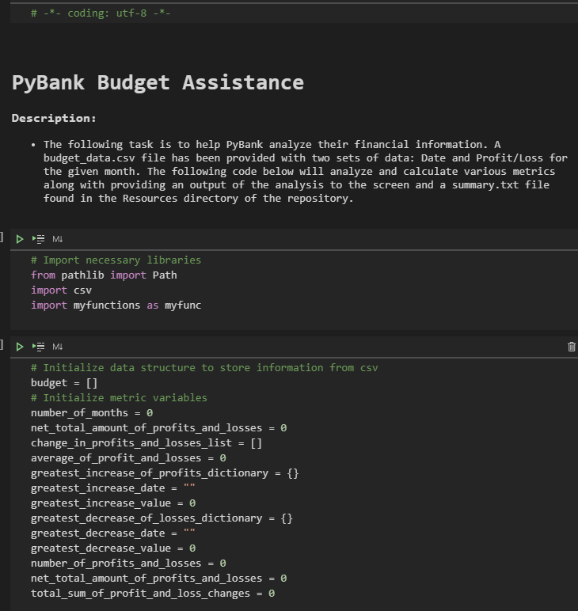

# python-homework
#### Assignment to show learning of topics over the last several weeks in Rice University FinTech Bootcamp!

---

## Table of contents
* [General info](#general-info)
* [Screenshots](#screenshots)
* [Technologies](#technologies)
* [Installation Guide](#installation-guide)
* [Code Examples](#code-examples)
* [Usage](#usage)
* [Status](#status)
* [Contributors](#contributors)

---

## General Information
#### The following repository contains two activities.  The first activity includes resources and files in the PyBank directory to pull in data from a .csv file, analyse the data to find various metrics, and produce a summary to the screen along with a summary.txt file.  The second optional activity relates to the resources and files in the PyRamen directory to pull in data from a .csv file, analyse the data to find various metrics, and produce a report to a .txt file.

---

## Screenshots


Output Summary


---

## Technologies
    * Python - Version 3.8.5
    * VS Code - Version 1.49.1
    * Jupyter Notebook - Version 6.1.1
    * Windows 10
    * Library - pathlib
    * Library - budgpy

---

## Installation Guide
1. Download entire python-homework repository
2. Open Git Terminal
    
    
    
3. Navigate into repository file path where the repository downloaded.

    

4. The files should be visible and ready to run.  *See usage [Usage](#usage) section below for instructions on how to run the program.
    
---

## Code Examples
- A summary output function to print a specific formatted summary to the screen and output a summary.txt file.

``` python
def summary_output(number_of_months_in_budget, net_total_amount_of_profits_and_losses, average_of_profit_and_losses, 
greatest_change_dictionary, greatest_decrease_of_losses_dictionary):
    """Accepts metric variables and prints a standard output to the screen along with a summary.txt file to a Resources directory.
    The dictionaries must contain 'date' and 'pnl' indecies.
    
    Args:
        number_of_months_in_budget (int): The number of months in the budget
        net_total_amount_of_profits_and_losses (int): The total amount of combined profits and losses.
        average_of_profit_and_losses (int): The average value of profits and losses.
        greatest_change_dictionary (dict): The greatest change with a 'date' and 'pnl' (profit and loss) index
        greatest_decrease_of_losses_dictionary (dict):  The greatest decrease of losses with a 'date' and 'pnl' (profit and loss) index

    Output:
        Outputs summary message to screen and ./Output/summary.txt
    """

    # Capture file path to be written
    output_path = Path("./Output/summary.txt")

    # Open output path 
    filewriter = open(output_path, 'w+')

    # Formatting individual rows for summary output and concatinates each string
    summary_message = "" 
    summary_message += "Financial Analysis\n"
    summary_message += "----------------------------\n"
    summary_message += f"Total Months: {number_of_months_in_budget}\n"
    summary_message += f"Total: ${net_total_amount_of_profits_and_losses}\n"
    summary_message += f"Average Change: ${average_of_profit_and_losses}\n"
    summary_message += f"Greatest Increase in Profits: {greatest_change_dictionary['date']} (${greatest_change_dictionary['pnl']})\n"
    summary_message += f"Greatest Decrease in Profits: {greatest_decrease_of_losses_dictionary['date']} (${greatest_decrease_of_losses_dictionary['pnl']})\n"
    
    # Outputs summary message to screen
    print(summary_message)

    # Writes summary message to output path
    filewriter.write(summary_message)

    # Closes file
    filewriter.close()
```


``` python
def calculate_sum(list_of_dictionaries, key_name):
    """Accepts a list of dictionaries and loops through the list adding each key value.
    
    Args:
        list_of_dictionaries (list): A list of dictionaries
        key_name (str): The name of the key in the dictionaries to sum

    Returns:
        The sum of all the specified key values in the list.
    """

    # Initialize variables
    sum = 0

    # Loop through list
    for a_dictionary in list_of_dictionaries:

        # Add key values to sum variable
        sum += a_dictionary[key_name]
        
    return sum
```

---

## Usage
1. To run the process navigate to the directory where main.py is located using Git Terminal.

    

2. Execute the command 'python main.py' in the terminal.

    

3. The program runs and summary outputs to the screen and creates a summary.txt file in the OutPut directory of the PyBank folder.

    

---

## Status
Project is:
    - PyBank: _in progress_
    - PyMenu: _in progress_

---

## Contributors
Jonathan Owens, jonathan.owens@gmail.com
