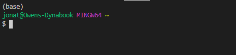

# python-homework
    - Assignment to show learning of topics over the last several weeks in Rice University FinTech Bootcamp!

---

## Table of contents
* [General info](#general-info)
* [Screenshots](#screenshots)
* [Technologies](#technologies)
* [Installation Guide](#installation-guide)
* [Code Examples](#code-examples)
* [Usage](#usage)
* [Status](#status)
* [Contributors](#contributors)

---

## General info
    - The following repository contains two activities.  The first activity includes resources and files in the PyBank directory to pull in data from a .csv file, analyse the data to find various metrics, and produce a summary to the screen along with a summary.txt file.  The second optional activity relates to the resources and files in the PyRamen directory to pull in data from a .csv file, analyse the data to find various metrics, and produce a report to a .txt file.

---

## Screenshots

---

## Technologies
    * Python - Version 3.8.5
    * VS Code - Version 1.49.1
    * Jupyter Notebook - Version 6.1.1
    * Windows 10
    * Library - pathlib
    * Library - budgpy

---

## Installation Guide
1. Download entire python-homework repository
2. Open Git Terminal
    
    

3. Navigate into repository file path where the repository downloaded.

    

---

## Code Examples

---

## Usage
1. To run the process navigate to the directory where main.py is located using Git Terminal.

    

2. Execute the command 'python main.py' in the terminal.

    

3. The program runs and summary outputs to the screen and creates a summary.txt file in the OutPut directory of the PyBank folder.

    

---

## Status
Project is:
    - PyBank: _in progress_
    - PyMenu: _in progress_

---

## Contributors
Jonathan Owens, jonathan.owens@gmail.com
